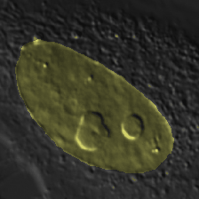
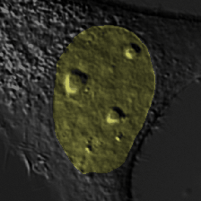

# HeLa Segmentation Notebook

This repository contains a Jupyter-lab Notebook showing image segmentation of the nucleus of HeLa cells using TensorFlow and Keras.

Image segmentation is done using a U-net network. 

The default example uses the "mobilenet" backbone and "imagenet" weights. 

See the project https://github.com/qubvel/segmentation_models for other backbones and weights.

# Screenshots

 

 

# About the Images

All images in this project are DIC images of HeLa cells under normal conditions.

# How to Create the Training Masks

Training masks are generated from the DIC images and edited with ImageJ/Fiji. See the directory tree as an example and follow the next steps:

1) Open the image.

2) Select the contour of the body with the "Polygon Selection" button.

3) Create a mask as "Edit->Selection->Create mask".

4) Select the mask using the "Wand(tracing) tool".

5) Set a number for the body of the Mask as: "Process->Math->Set", and select a number different than 0 (background). For more than two objects (background and nucleus) change "Labels" in the Notebook.

6) Save the mask using the same name of the input image, but inside the masks folder (see directory tree).

